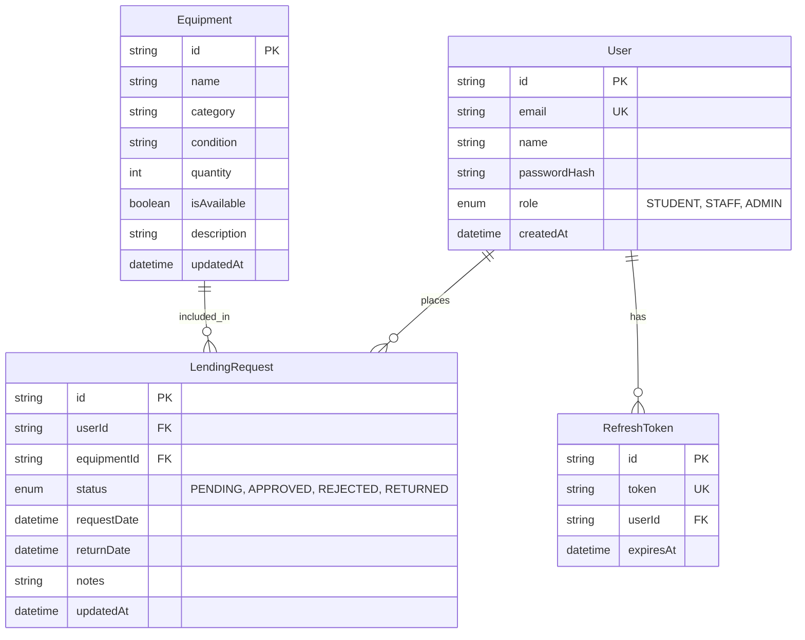

# Entity Relationship Diagram

This document outlines the database schema and relationships for the School Equipment Lending Portal.

## Database Schema (Prisma)

## Core Relationships

1.  **User -> LendingRequest (1:N)**: A user can submit multiple requests over time.
2.  **Equipment -> LendingRequest (1:N)**: An item can be part of many lending requests throughout its lifecycle.
3.  **User -> RefreshToken (1:N)**: A user can have multiple active sessions (tokens) across different devices.
