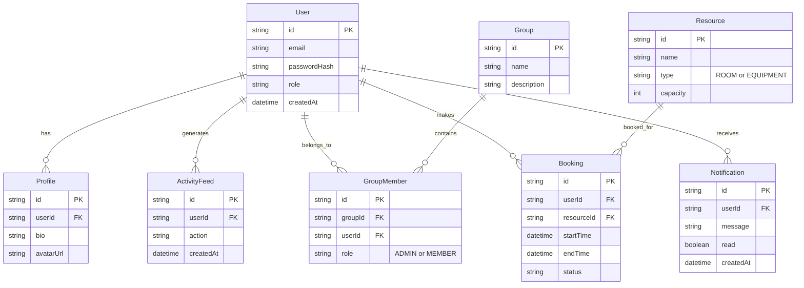

# Entity Relationship Diagrams

This document outlines the data schemas and their relationships across the microservices. While each microservice manages its own logical domain, they reference common keys (like `userId`).

## Unified ERD Map

## Schema Domains

1. **Auth Service**: Owns the `User` table (credentials and identity).
2. **User Service**: Owns `Profile` and `ActivityFeed`. Maps to `User.id`.
3. **Group Service**: Owns `Group` and `GroupMember`.
4. **Booking Service**: Owns `Resource` and `Booking`.
5. **Notification Service**: Owns `Notification`.
